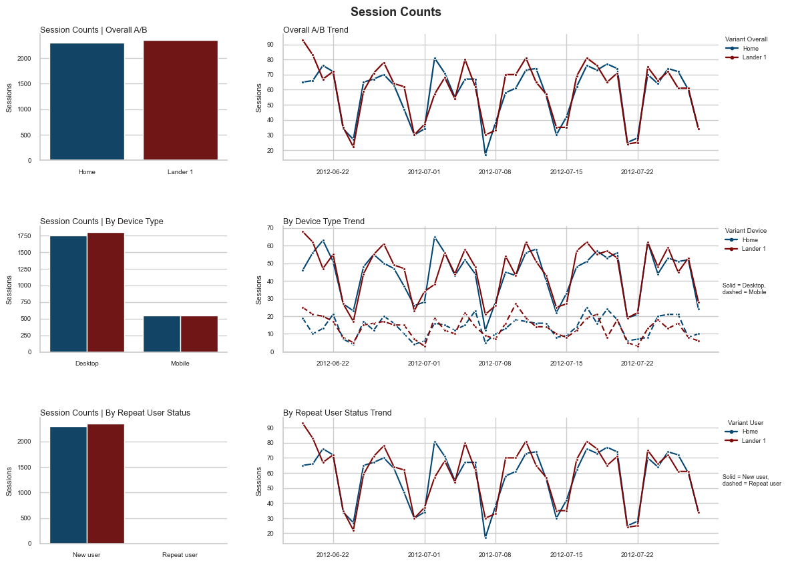
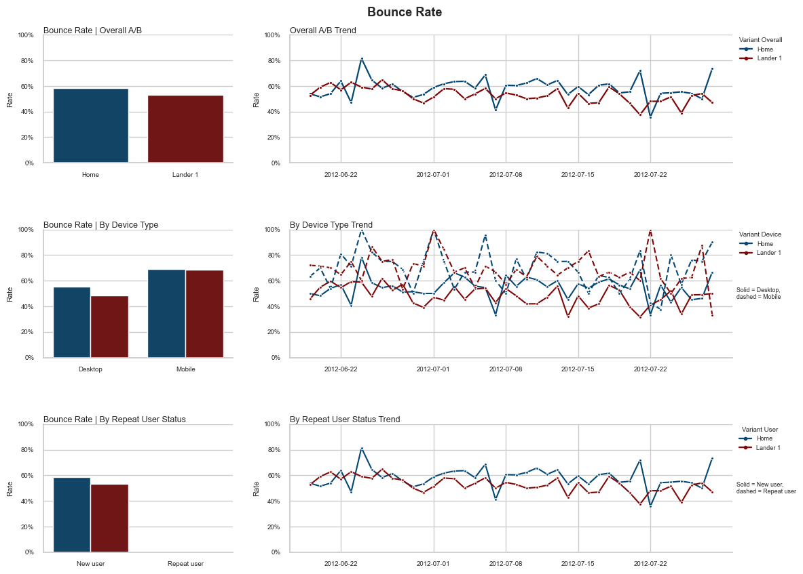
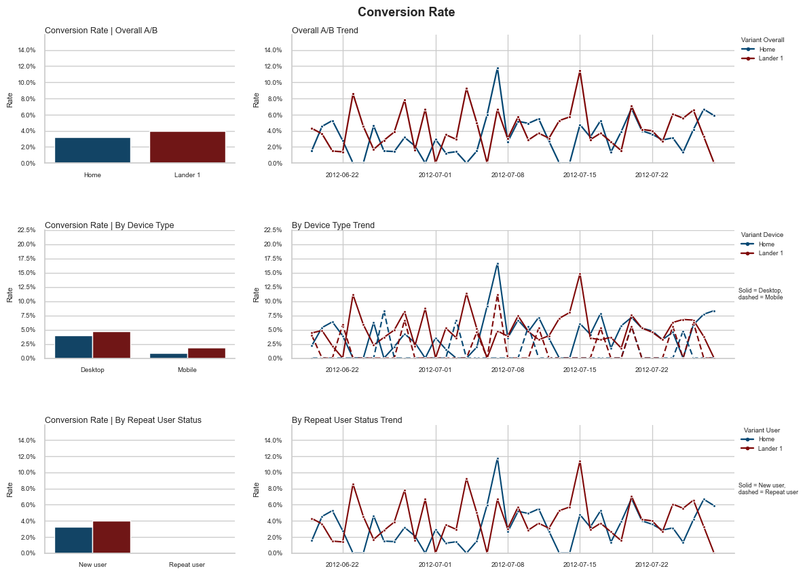

# Landing Page A/B Test Analysis
<image src="./img/cover.png" alt="Landing Page A/B Test" width="100%"/>

- [Landing Page A/B Test Analysis](#landing-page-ab-test-analysis)
  - [Case Brief](#case-brief)
  - [Data](#data)
    - [Data Model](#data-model)
  - [Pre-Analysis](#pre-analysis)
  - [Analysis Overview](#analysis-overview)
    - [Experiment Identification \& Traffic Filtering](#experiment-identification--traffic-filtering)
    - [Exploratory Data Analysis (EDA)](#exploratory-data-analysis-eda)
    - [Experiment Validity Checks](#experiment-validity-checks)
    - [Metric Calculation Methodology](#metric-calculation-methodology)
    - [Statistical Testing Results:](#statistical-testing-results)
      - [Heterogeneous Treatment Effect Analysis](#heterogeneous-treatment-effect-analysis)
  - [Final Decision](#final-decision)

## Case Brief

>  Case provdied by Maven Analytics: https://mavenanalytics.io/guided-projects/landing-page-a-b-test

**THE SITUATION:**

You work as a Marketing Analyst for **Maven Fuzzy Factory**, an online retailer that sells children's toys.

**THE ASSIGNMENT**

The Website Manager noticed that the homepage bounce rate was unusually high (60%) and decided to test a new landing page for a segment of traffic.

**Your task is to analyze the results of the A/B test to see if the new landing page drove a statistically significant improvement.**

**THE OBJECTIVES**

1. Filter the website traffic
2. Calculate the bounce rates
3. Verify the significance

## Data
The dataset provided by Maven Analytics is a simulated E-Commerce database based on real-world data from an online toy retailer. It includes detailed information on website sessions, pageviews, orders, and refunds, allowing for comprehensive analysis of user behavior and marketing performance.

Dataset: [Toy Store E-Commerce Database](https://mavenanalytics.io/data-playground/toy-store-e-commerce-database)

### Data Model

| Table | Key Fields |
|-------|-----------|
| **WEBSITE_SESSIONS** | website_session_id (PK), user_id (FK), created_at, utm_source, utm_campaign, utm_content, device_type, http_referer |
| **WEBSITE_PAGEVIEWS** | website_pageview_id (PK), website_session_id (FK), created_at, pageview_url |
| **ORDERS** | order_id (PK), website_session_id (FK), user_id (FK), primary_product_id (FK), created_at, items_purchased, price_usd, cogs_usd |

---

## Pre-Analysis
> *It should be considered that this is a post-experiment analysis and the data has already been collected with the necessary controls in place.*

**Objective:**
Improve bounce rate by testing a new landing page.

**Hypothesis:**
- Null Hypothesis: The new landing page does not drive a statistically significant improvement in bounce rate.
- Alternative Hypothesis: The new landing page drives a statistically significant improvement in bounce rate.

**Targeting:**
Users coming from a specific campaign `('google - g_ad_1')` were randomly assigned to either the control group (Home) or the treatment group (new landing page).

**Evaluation Metrics:**
- Primary Metric: **user-level Bounce Rate**

    (the percentage of visitors who navigate away from the site after viewing only one page).

- Guardrail Metrics:
  - Conversion Rate
    (the percentage of visitors who complete a desired action, such as making a purchase).
  - AOV (Average Order Value)
    (the average amount of money spent per order).

    **Rationale:** To protect against false positives on the primary metric, and avoiding the scenario where the new landing page improves bounce rate but causes a significant drop in **conversion rate** (e.g. by causing distractions or confusion) or **AOV** (e.g. by promoting lower-value items), we would need to reconsider the decision to ship the change.

## Analysis Overview
I assume the following Experiment Validity Assumptions are met:
  - Users are randomly assigned to variants
  - Sessions are independent
  - No major external changes during the test period
  - Tracking is consistent across variants

### Experiment Identification & Traffic Filtering
As stated in the case briefed, first goal is to identify the A/B test in the data and filter the traffic accordingly.This step is necessary as no experiment design or data collection information was provided, so we need to reverse-engineer the test setup from the data itself.

In order to do that, we will start by visualizing the **campaign timeline (landing page × traffic source)** to see how different combinations of landing pages and traffic sources evolved over time. This will allow us to detect where an A/B test is hiding in the data and then apply the necessary filters to isolate the relevant sessions for our analysis.

<image src="./img/highlighted_experiment_date.png" alt="Campaign Timeline Chart" width="100%"/>

This bird's-eye view of how Maven Fuzzy Factory ran its campaigns allow us **detect where an A/B test is hiding in the data**.
A valid A/B test requires three conditions to be met simultaneously:

| Condition                   | Why it matters                                         |
| ----------------------------- | -------------------------------------------------------- |
| **Same traffic source**     | Ensures both groups come from the same audience        |
| **Different landing pages** | That's the variable being tested                       |
| **Overlapping time window** | Ensures both groups faced the same external conditions |

in the highlighted section of the chart above, we can see that `g_ad_1` is the only traffic source that served two different landing pages at the same time (`/home` and `/lander-1`). The overlap window — when both pages were live simultaneously for the same traffic source — runs from **2012-06-19 to 2012-07-29**.

The filtered dataset following these criteria is available in the `data/processed` folder, with the corresponding filtering code in the `data_cleaning.ipynb` notebook.

### Exploratory Data Analysis (EDA)
The filtered dataset contains **4,645 sessions** from users who came through `g_ad_1` during the overlap window.

| Group                   | Sessions | Share |
| ------------------------- | ---------- | ------- |
| `/home` (control)       | 2,295    | 49.4% |
| `/lander-1` (treatment) | 2,350    | 50.6% |

We will start by checking the distribution of sessions between the two groups to confirm that the randomization worked as expected.

distribution of session, bounce rate and conversion rate over time will also be plotted to check for any temporal trends or anomalies that could indicate a novelty effect or pre-experiment bias.

    
    
    

### Experiment Validity Checks

- **Data Leakage**: No users were found in both control and treatment groups simultaneously.
Randomization unit is confirmed at **user level**.

- **Sample Ratio Mismatch (SRM):**
We **fail to reject** the null hypothesis —
the observed split is consistent with the expected 50/50 randomization.
No Sample Ratio Mismatch detected. (P-value of 0.42 >> 0.05)

- **Novelty Effect & Pre-Experiment Bias**: Metric trendlines (bounce rate, conversion rate) were plotted over the
test window for both groups. Both groups follow **similar temporal trends**, with no unusual spike in the treatment group at the start of the test — suggesting no novelty effect is present.

- **Device Breakdown:** Mobile sessions are fewer than desktop in both groups, but the
**ratio is consistent across groups** — this is a traffic characteristic,
not a bias introduced by the experiment.

✅ All validity checks passed. The experiment is clean and results can be trusted.

### Metric Calculation Methodology

- **Bounce Rate**:

    To ensure the same randomization unit for metric calculation and hypothesis testing, we will calculate bounce rate at the **user level** by first averaging within each user and then averaging across users.
    $$
    BR = \frac{1}{N} \sum_{u=1}^{N} \bar{b}_u

    $$

    Where:

    $$
    \bar{b}_u = \frac{1}{S_u} \sum_{s=1}^{S_u} \mathbb{1}[\text{bounced}_{u,s}]

    $$

    So substituting:

    $$
    BR = \frac{1}{N} \sum_{u=1}^{N} \left( \frac{1}{S_u} \sum_{s=1}^{S_u} \mathbb{1}[\text{bounced}_{u,s}] \right)

    $$

    *Notation:*
    - *$N$*: Total number of users in the group
    - *$S_u$*: Number of sessions for user $u$
    - *$\mathbb{1}[\text{bounced}_{u,s}]$*: 1 if session $s$ of user $u$ bounced, 0 otherwise
    - *$\bar{b}_u$*: Bounce rate for user $u$ across their sessions

    > *The key insight is the two-step aggregation:*
    >  *First average **within** each user → $\bar{b}_u$ (each user gets one number regardless of how many sessions they had), Then average **across** users → $BR$ (each user counts equally)*

- **Conversion Rate**

    The same logic applies to all other metrics as well.

    $$
    CR = \frac{1}{N} \sum_{u=1}^{N} \left( \frac{1}{S_u} \sum_{s=1}^{S_u} \mathbb{1}[\text{converted}_{u,s}] \right)

    $$

- **Average Order Value**

    $$
    AOV = \frac{1}{N} \sum_{u=1}^{N} \left( \frac{1}{\sum_{s=1}^{S_u} O_{u,s}} \sum_{s=1}^{S_u} \sum_{o=1}^{O_{u,s}} v_{u,s,o} \right)

    $$

    Where $O_{u,s}$ is the number of orders in session $s$ for user $u$, and $v_{u,s,o}$ is the value of order $o$.

In this dataset, $S_u = 1$ for all users, meaning each user has exactly one session. Therefore, $\bar{b}_u = \mathbb{1}[\text{bounced}_{u,s}]$ and all metrics simplify to simple means. While the formulas appear complex, they collapse to basic averages under this constraint. However, the two-step aggregation framework above is essential for ensuring the same randomization unit (user-level) is used for both metric calculation and hypothesis testing, maintaining statistical validity.

### Statistical Testing Results:
Statistical result summaries is as follows:
| Metric          | Control | Treatment | Absolute Δ | Significant    |
| ----------------- | --------- | ----------- | ------------- | ------------- |
| **Bounce Rate**    | 58.56%  | 53.15%    | -5.41pp     | ✅ p=0.0002    |
| Conversion Rate | 3.22%   | 4.00%     | +0.78pp     | ❌ p=0.1569    |
| AOV             | $49.99  | $49.99    | $0          | ❌ No variance |

**Interpretation**
- **Bounce Rate 95% CI:** (2.56pp, 8.26pp) absolute or (4.37%, 14.11%) relative improvement:
    <image src="./img/primary_metric_ci.png" alt="Bounce Rate Confidence Interval" width="100%" padding="10px" margin="40px" caption="Bounce Rate Confidence Interval"/>
    *the entire interval is above zero, confirming both statistical and practical significance*

- **Guardrail metrics are clean:** conversion rate trended positively
but was underpowered (too few conversions to detect a real effect).
AOV showed zero variance — spending behavior was completely unaffected
by the page change. **No guardrail was violated**.

#### Heterogeneous Treatment Effect Analysis
To further understand the results, we did break down the bounce rate by **device type** (desktop vs mobile) to see whether the treatment effect is consistent across segment.
The results are summarized in the table below:

| Segment | Control BR | Treatment BR | Δ      | Corrected p | Significant |
| --------- | ------------ | -------------- | --------- | ------------- | ------------- |
| Desktop | 55.19%     | 48.53%       | -6.65pp | 0.0001      | ✅ Yes      |
| Mobile  | 69.27%     | 68.44%       | -0.83pp | 0.7662      | ❌ No       |

**Interpretation:**

- The new landing page drives a strong, significant improvement for
**desktop users** but has no meaningful effect on **mobile users**.

- This is a heterogeneous treatment effect; the two segments respond
differently to the same intervention. Critically, the new page does
**not harm** mobile users (the bounce rate is nearly identical), but
it also does not help them.

- The mobile bounce rate of ~69% in both groups signals a **separate, pre-existing UX problem** on mobile that this test was not designed to solve and did not address.

## Final Decision

> **Ship the new landing page to all users** from `g_ad_1` **immediately;**
> **suggested a dedicated mobile UX test for improvement in mobile bounce rate.**

**Rationale:**

  - **Statistical significance:** ✅ Strong (p=0.0002 overall, p=0.0001 desktop)
  - **Practical significance:** ✅ 6.65pp desktop improvement — a reasonable positive effect (9.24% relative)
  - **Confidence interval:** ✅ Entirely above zero (2.90pp, 10.41pp) on desktop
  - **Guardrail metrics:** ✅ No negative movement in CR or AOV
  - **Mobile effect:** ⚠️ Neutral — no harm, but no benefit
  - **Sample ratio mismatch:** ✅ Clean 50/50 split confirmed
  - **Data leakage:** ✅ Zero overlap between groups

---

**Contact**
For questions or feedback regarding this analysis, please reach out:

**👓 Am. Jandaghian**

  
